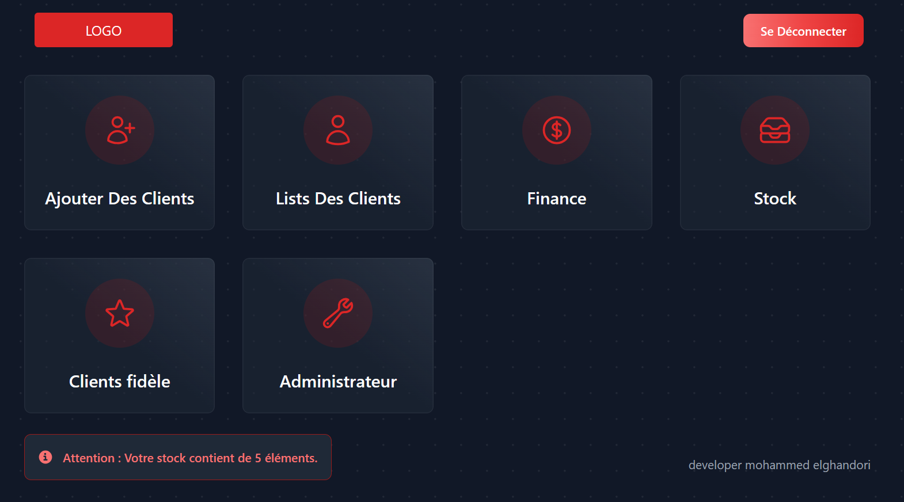

## Project Name:"Business-Organizer"

I am delighted to share with you a new project that I have programmed to assist individuals working online. The website allows clients to participate in the service and automatically calculates their subscription duration and collects payments, which are then displayed in the finance section and divided according to the bank type or cash payments. It also shows the remaining balance. Additionally, the website enables users to manage inventory, track sales operations, and receive alerts when the quantity of items reaches 5 pieces.

Furthermore, the website includes a section for monitoring clients and their subscription duration. Users are notified when a client's subscription expires. Lastly, there is a special section dedicated to loyal and exceptional customers, where special offers can be provided.

The website has been operational for two months now and offers a distinctive feature that helps users overcome their reliance on Word and Excel, which they used previously. I am excited to share this project with you and look forward to receiving your feedback and suggestions.

## image of website :

### Login Page:

### Dashboard:

## Programming Technologies Used:
- laravel
- tailwind css

## social media :
- facebook page : MG-code
- LinkedIn : mohammed elghandori

